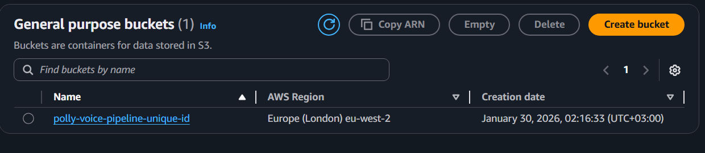
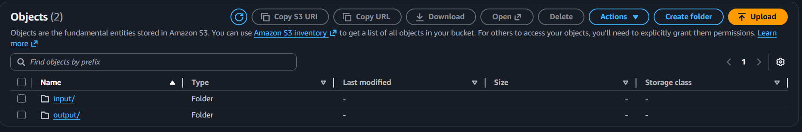
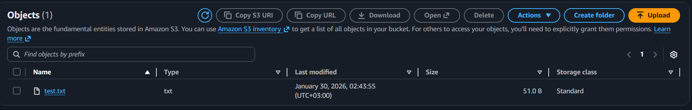
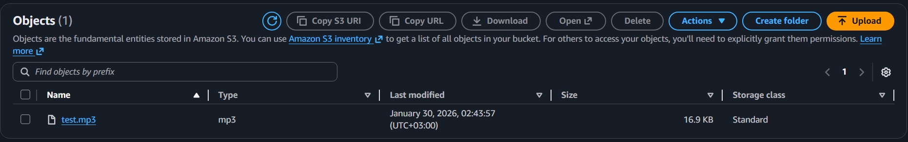
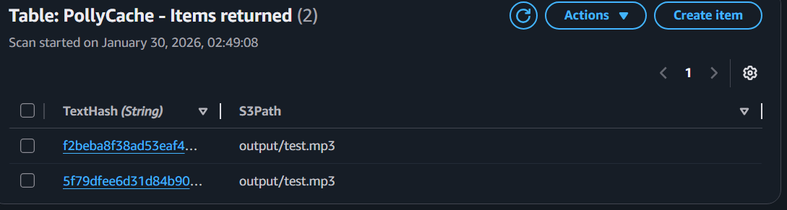

# Serverless-Event-Driven-Audio-Pipeline

Bu proje, S3'e yüklenen metin dosyalarını otomatik olarak algılayan, Amazon Polly kullanarak sese çeviren ve maliyet optimizasyonu için DynamoDB ile caching mekanizması sunan **Serverless** bir mimari örneğidir.

## Özellikler
- **Event-Driven:** S3 tetikleyicisi ile tamamen asenkron çalışma.
- **Cost Optimization:** Aynı metni tekrar tekrar sese çevirip boşuna para ödememek için, daha önce çevrilmiş metinleri hafızasında (DynamoDB) tutan akıllı bir kontrol mekanizması eklendi.
- **Scalable:** AWS Lambda ve S3 kullanılarak teorik olarak sonsuz ölçeklenebilirlik.
- **Infrastructure:** AWS Console üzerinden kurulmuştur (Opsiyonel: Terraform eklenmek üzere planlandı).

## Kullanılan Teknolojiler
- **Amazon Polly:** Text-to-Speech dönüşümü.
- **AWS Lambda:** Serverless compute katmanı.
- **Amazon S3:** Giriş (Text) ve çıkış (Audio) depolama.
- **Amazon DynamoDB:** Metadata ve Cache yönetimi.
- **Boto3:** AWS Python SDK.

## Kurulum ve Kullanım
1. `input/` klasörüne bir `.txt` dosyası yükleyin.
2. Lambda fonksiyonu otomatik olarak tetiklenecektir.
3. Üretilen `.mp3` dosyasını `output/` klasöründen alın.

Ses Dosyası ayriyetten mp3 şeklinde eklenmiştir.

